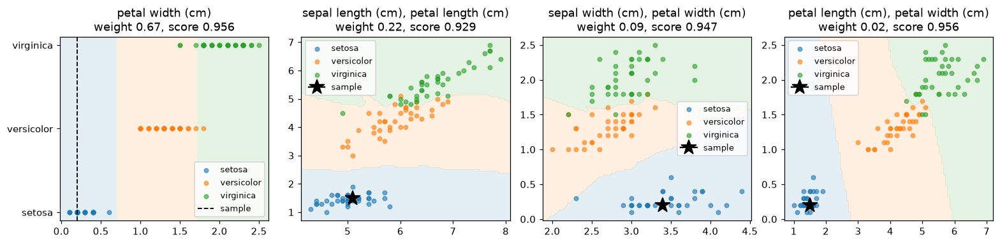

# subspaceknn

Interpretable k-nearest-neighbour classification by complementary selection of low-dimensional feature subspaces.



*The four subspaces of a model fitted on iris, each with its decision regions, its weight in the vote and its score on its own. The star is the sample being explained.*

`SubspaceKNNClassifier` fits a k-nearest-neighbour model on every small subset of features, one, two or three at a time, and builds a small ensemble of them that votes on new samples. Every member lives in a space that can be drawn, so a prediction is explained by a handful of pictures like the ones above: which subspaces agreed, which dissented, and where the sample sits among its neighbours in each.

What sets the method apart is how the ensemble is chosen. Keeping the subspaces that score best on their own fills the ensemble with near-copies of each other. **Complementary selection** instead adds subspaces one vote at a time, each time the one that most improves the ensemble's out-of-fold predictions. On iris above, the subspace with the second-largest weight has the lowest individual score of the four: it earns its place by being right where petal width alone is unsure.

On fourteen benchmark datasets, complementary selection gains two to three points of macro-F1 over ranking subspaces by their own score. With subspaces of up to three features it beats plain kNN on all features on average. The [benchmark](benchmark.md) has the details.

## Installation

```sh
pip install subspaceknn            # core: numpy and scikit-learn
pip install "subspaceknn[plot]"    # adds matplotlib for plot_subspaces
```

The package supports Python 3.10 to 3.13 and scikit-learn 1.6 or newer.

## Quick start

```python
from sklearn.datasets import load_iris
from sklearn.model_selection import train_test_split

from subspaceknn import SubspaceKNNClassifier

iris = load_iris(as_frame=True)
X, y = iris.data, iris.target_names[iris.target]
X_train, X_test, y_train, y_test = train_test_split(X, y, random_state=0, stratify=y)

clf = SubspaceKNNClassifier(subspace_size=(1, 2), n_subspaces=4).fit(X_train, y_train)
print(clf.score(X_test, y_test))  # 0.947

explanation = clf.explain(X_test.iloc[[0]])[0]
for vote in explanation.votes:
    print(vote.feature_names, vote.prediction, round(vote.weight, 2))
```

The estimator follows the scikit-learn contract, so it works inside `Pipeline`, `GridSearchCV` and `cross_val_score`.

## Where to go next

- The [user guide](guide.md) walks through fitting, choosing the parameters, reading an explanation and drawing the subspaces.
- The [method](method.md) note defines the algorithm, explains each design choice and relates it to prior work.
- The [benchmark](benchmark.md) compares complementary selection with ikNN-style ranking and plain kNN on fourteen datasets.
- The [API reference](api.md) documents every parameter and fitted attribute.

## Credits

The idea of an ensemble of drawable kNN models comes from Brett Kennedy's [Interpretable kNN (ikNN)](https://towardsdatascience.com/interpretable-knn-iknn-33d38402b8fc) (2024), which ranks pairs of features by their individual accuracy. That scheme is available here as `selection="ranked"`. Complementary selection applies the ensemble selection of Caruana et al. (2004) to subspace kNN models. The full list of references is at the end of the [method](method.md#references) note.
